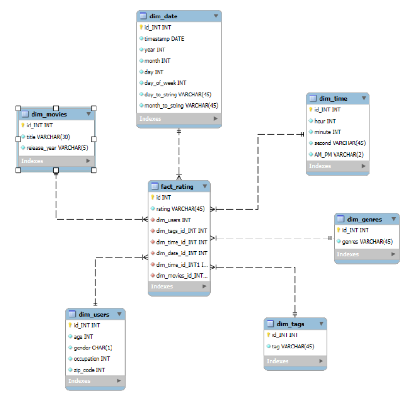

# DT_Mravec - MovieLens
Databázové Technológie - FINAL - Matias Mravec 

Tento repozitár obsahuje implementáciu ETL procesu v Snowflake, určenú na analýzu dát z datasetu MovieLens. Projekt sa sústreďuje na skúmanie používateľského správania a preferencií v čítaní prostredníctvom hodnotení kníh a demografických údajov. Vytvorený dátový model podporuje multidimenzionálnu analýzu a vizualizáciu kľúčových ukazovateľov.

---
## **1. Úvod a popis zdrojových dát**
Cieľom semestrálneho projektu je analyzovať dáta týkajúce sa kníh, používateľov a ich hodnotení. Táto analýza umožňuje identifikovať trendy v čitateľských preferenciách, najpopulárnejšie knihy a správanie používateľov.

Zdrojové dáta pochádzajú z Kaggle datasetu dostupného [tu](https://grouplens.org/datasets/movielens/). Dataset obsahuje osem hlavných tabuliek:
- `movies`
- `age_groups`
- `genres`
- `genres_movies`
- `occupations`
- `ratings`
- `tags`
- `users`

Účelom ETL procesu bolo tieto dáta pripraviť, transformovať a sprístupniť pre viacdimenzionálnu analýzu.

---

### **1.1 Dátová architektúra**

### **ERD diagram**
Surové dáta sú usporiadané v relačnom modeli, ktorý je znázornený na **entitno-relačnom diagrame (ERD)**:

<p align="center">
  
  <br>
  <em>Obrázok 1 Entitno-relačná schéma AmazonBooks</em>
</p>

---
## **2 Dimenzionálny model**

Navrhnutý bol **hviezdicový model (star schema)**, pre efektívnu analýzu kde centrálny bod predstavuje faktová tabuľka **`fact_ratings`**, ktorá je prepojená s nasledujúcimi dimenziami:
- **`dim_movies`**: Uchováva údaje o filmoch, ako sú identifikátor filmu, jeho názov a rok vydania.
- **`dim_tags`**: Uchováva značky, ktoré môžu byť využité na analýzu sentimentu alebo triedenie filmov podľa ďalších kritérií.
- **`dim_genres`**: Obsahuje informácie o žánroch, vrátane ich identifikátorov a názvov.
- **`dim_users`**: Poskytuje demografické údaje o používateľoch, ako napríklad ich vek, kategóriu veku, pohlavie, poštové smerovacie číslo a povolanie.
- **`dim_date`**: Zahŕňa dáta súvisiace s hodnotiacimi dátumami, ako sú konkrétny deň, mesiac, rok, názvy mesiacov a dni v týždni.
- **`dim_time`**: Obsahuje detailné informácie o tagoch, ako sú samotné tagy, dátum a čas ich vytvorenia.


Štruktúra hviezdicového modelu je znázornená na diagrame nižšie. Diagram ukazuje prepojenia medzi faktovou tabuľkou a dimenziami, čo zjednodušuje pochopenie a implementáciu modelu.

<p align="center">
  
  <br>
  <em>Obrázok 2 Schéma hviezdy pre MovieLens</em>
</p>

---

## **3. ETL proces v Snowflake**
ETL proces sa skladal z troch hlavných krokov: `extrahovanie` (Extract), `transformácia` (Transform) a `načítanie` (Load). Tento postup bol implementovaný v Snowflake a jeho cieľom bolo pripraviť dáta zo staging vrstvy do viacdimenzionálneho modelu, ktorý je optimalizovaný na analýzu a vizualizáciu.

---
### **3.1 Extract (Extrahovanie dát)**
Dáta zo zdrojového datasetu vo formáte `.csv` boli najprv nahrané do Snowflake cez interné stage úložisko s názvom `my_stage`. Stage v Snowflake slúži ako dočasný priestor na import alebo export dát. Vytvorenie stage bolo realizované pomocou príkazu:

#### Príklad kódu:
```sql
CREATE OR REPLACE STAGE snail_stage;
```
Do stage boli následne nahrané súbory obsahujúce údaje o knihách, používateľoch, hodnoteniach, zamestnaniach a úrovniach vzdelania. Tieto dáta boli následne importované do staging tabuliek prostredníctvom príkazu `COPY INTO`. Pre každú tabuľku bol použitý podobný príkaz:

```sql
COPY INTO users_staging
FROM @snail_stage/users.csv
FILE_FORMAT = (TYPE = 'CSV' FIELD_OPTIONALLY_ENCLOSED_BY = '"' SKIP_HEADER = 1)
ON_ERROR = 'CONTINUE';
```

V prípade nekonzistentných záznamov bol použitý parameter `ON_ERROR = 'CONTINUE'`, ktorý umožnil pokračovať v procese aj v prípade výskytu chýb, bez jeho prerušenia.

---

### **3.2 Transform (Transformácia dát)**

V tejto fáze vytvoríme dimenzie a faktovú tabuľku. Dimenzie poskytujú kontext, zatiaľ čo faktová tabuľka obsahuje kľúčové metriky.

---
#### Vytvorenie Dimenzíí

##### **1. Dimeznia : `dim_users`**
Obsahuje údaje o používateľoch vrátane vekovej skupiny, pohlavia a zamestnania:

```sql
CREATE OR REPLACE TABLE dim_users AS
SELECT
    users_staging.id AS dim_user_id,
    users_staging.gender AS gender,
    users_staging.zip_code AS zip_code,
    CASE
        WHEN users_staging.age < 18 THEN 'Under 18'
        WHEN users_staging.age BETWEEN 18 AND 24 THEN '18-24'
        WHEN users_staging.age BETWEEN 25 AND 34 THEN '25-34'
        WHEN users_staging.age BETWEEN 35 AND 44 THEN '35-44'
        WHEN users_staging.age BETWEEN 45 AND 54 THEN '45-54'
        WHEN users_staging.age >= 55 THEN '55+'
        ELSE 'Unknown'
    END AS age_group,
    occupations_staging.name AS occupation
FROM users_staging
LEFT JOIN occupations_staging ON users_staging.occupation_id = occupations_staging.id;
```

##### **2. Dimeznia : `dim_movies`**
Obsahuje údaje o filmoch vrátane názvu a roku vydania:

```sql
CREATE OR REPLACE TABLE dim_movies AS
SELECT
    movies_staging.id AS dim_movie_id,
    movies_staging.title AS title,
    movies_staging.release_year AS release_year
FROM movies_staging;
```

##### **3. Dimenzia : `dim_tags`**
Obsahuje údaje o značkách (tags), ktoré sú používané na označovanie filmov:

```sql
CREATE OR REPLACE TABLE dim_tags AS
SELECT
    tags_staging.id AS dim_tags_id,
    tags_staging.tag AS tag
FROM tags_staging;
```

##### **4 Dimenzia:  `dim_time`**
Obsahuje údaje o čase hodnotení filmov vrátane hodín, minút a dennej časti (AM/PM):

```sql
CREATE OR REPLACE TABLE dim_time AS
SELECT
    ROW_NUMBER() OVER (ORDER BY CAST(rated_at AS TIME)) AS dim_time_id,
    CAST(rated_at AS TIME) AS timestamp,
    DATE_PART(hour, rated_at) AS hour,
    DATE_PART(minute, rated_at) AS minute,
    DATE_PART(second, rated_at) AS second,
    CASE
        WHEN DATE_PART(hour, rated_at) < 12 THEN 'AM'
        ELSE 'PM'
    END AS am_pm
FROM (SELECT DISTINCT CAST(rated_at AS TIME) AS rated_at FROM ratings_staging);
```

##### **5. Dimenzia: `dim_date`**
Obsahuje údaje o dátumoch:

```sql
CREATE OR REPLACE TABLE dim_date AS
SELECT
    ROW_NUMBER() OVER (ORDER BY CAST(rated_at AS DATE)) AS dim_date_id,
    CAST(rated_at AS DATE) AS timestamp,
    DATE_PART(year, rated_at) AS year,
    DATE_PART(month, rated_at) AS month,
    DATE_PART(day, rated_at) AS day,
    DATE_PART(dow, rated_at) + 1 AS day_of_week,
    CASE DATE_PART(dow, rated_at) + 1
        WHEN 1 THEN 'Monday'
        WHEN 2 THEN 'Tuesday'
        WHEN 3 THEN 'Wednesday'
        WHEN 4 THEN 'Thursday'
        WHEN 5 THEN 'Friday'
        WHEN 6 THEN 'Saturday'
        WHEN 7 THEN 'Sunday'
    END AS day_string,
    CASE DATE_PART(month, rated_at)
        WHEN 1 THEN 'January'
        WHEN 2 THEN 'February'
        WHEN 3 THEN 'March'
        WHEN 4 THEN 'April'
        WHEN 5 THEN 'May'
        WHEN 6 THEN 'June'
        WHEN 7 THEN 'July'
        WHEN 8 THEN 'August'
        WHEN 9 THEN 'September'
        WHEN 10 THEN 'October'
        WHEN 11 THEN 'November'
        WHEN 12 THEN 'December'
    END AS month_string
FROM ratings_staging;
```
##### **6. Dimenzia `dim_genres`**
Obsahuje údaje o žánroch:

```sql
CREATE OR REPLACE TABLE dim_genres AS
SELECT
    genres_staging.id AS dim_genres_id,
    genres_staging.genres AS genre
FROM genres_staging;
```

#### **Vytvorenie faktovej tabuľky:**

##### **1. Faktová tabuľka: `fact_ratings`**
Obsahuje hodnotenia filmov spolu s príslušnými dimenziami:

```sql
CREATE OR REPLACE TABLE fact_ratings AS
SELECT
    ratings_staging.id AS fact_rating_id,
    ratings_staging.rating AS rating,
    dim_users.dim_user_id AS dim_user_id,
    dim_movies.dim_movie_id AS dim_movie_id,
    dim_time.dim_time_id AS dim_time_id,
    dim_date.dim_date_id AS dim_date_id,
    dim_genres.dim_genres_id AS dim_genres_id,
    dim_tags.dim_tags_id AS dim_tags_id
FROM ratings_staging
JOIN dim_users ON ratings_staging.user_id = dim_users.dim_user_id
JOIN dim_movies ON ratings_staging.movie_id = dim_movies.dim_movie_id
JOIN dim_date ON CAST(ratings_staging.rated_at AS DATE) = dim_date.timestamp
JOIN dim_time ON CAST(ratings_staging.rated_at AS TIME) = dim_time.timestamp
LEFT JOIN genres_movies_staging ON ratings_staging.movie_id = genres_movies_staging.movie_id
LEFT JOIN dim_genres ON genres_movies_staging.genre_id = dim_genres.dim_genres_id
LEFT JOIN tags_staging ON ratings_staging.id = tags_staging.movie_id
LEFT JOIN dim_tags ON tags_staging.id = dim_tags.dim_tags_id;
```
---

### **3.3 Load (Načítanie dát)**


Po úspešnom vytvorení dimenzií a faktovej tabuľky boli všetky dáta úspešne nahraté do finálnej štruktúry dátového skladu. V rámci optimalizácie využitia úložiska a udržania poriadku v databáze sme pristúpili k odstráneniu staging tabuliek, ktoré už po transformácii dát neboli potrebné. Tento krok zabezpečuje efektívnejšie spracovanie a správu dát v ďalších fázach procesu

```sql
DROP TABLE IF EXISTS users_staging;
DROP TABLE IF EXISTS occupations_staging;
DROP TABLE IF EXISTS movies_staging;
DROP TABLE IF EXISTS ratings_staging;
DROP TABLE IF EXISTS tags_staging;
DROP TABLE IF EXISTS genres_staging;
DROP TABLE IF EXISTS genres_movies_staging;
```

ETL proces v Snowflake transformoval pôvodné údaje z formátu `.csv` do hviezdicového viacdimenzionálneho modelu. Tento postup zahŕňal kroky, ako čistenie dát, ich obohatenie o nové informácie a štruktúrovanú reorganizáciu. Výsledný model ponúka možnosť analyzovať správanie a preferencie používateľov, čím vytvára pevný základ pre tvorbu vizualizácií a reportov.
